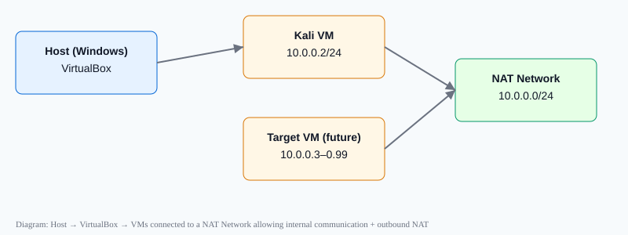

# Cybersecurity Lab Setup (VirtualBox + Kali Linux)

A reproducible guide to creating a small, private penetration-testing lab on a Windows host using VirtualBox and Kali Linux. This README documents the environment, step-by-step setup, verification commands, troubleshooting tips, and ethical guidance.

## Table of Contents
- [Project Overview](#project-overview)
- [Prerequisites](#prerequisites)
- [Lab Architecture](#lab-architecture)
- [Setup Steps](#setup-steps)
  - [Install 7-Zip](#install-7-zip)
  - [Install VirtualBox](#install-virtualbox)
  - [Create NAT Network (VirtualBox)](#create-nat-network-virtualbox)
  - [Import Kali Linux VM](#import-kali-linux-vm)
  - [Configure Kali Network (static IP)](#configure-kali-network-static-ip)
  - [Create Clean Snapshot](#create-clean-snapshot)
- [Verification](#verification)
- [Troubleshooting](#troubleshooting)
- [What I learned](#what-i-learned)
- [Security & Ethical Use](#security--ethical-use)
- [Tools & Resources](#tools--resources)
- [Author & License](#author--license)

## Project Overview
This project sets up an isolated lab network (NAT Network) where multiple VMs can communicate internally while still having controlled outbound internet access. It is intended only for learning and authorized testing.

## Prerequisites
- Host OS: Windows 10 (or newer)
- CPU: Intel Core i5 or equivalent with virtualization (VT-x/AMD-V) enabled in BIOS
- RAM: 8 GB (host); allocate at least 2 GB to Kali
- VirtualBox: 7.x
- 7-Zip (if distributed images are archived)
- Kali Linux OVA or VM image (download from official site)

Recommended: Create a snapshot/backup before making changes.

## Lab Architecture (example)
- Virtual network: NAT Network
- Network range: 10.0.0.0/24
- Kali VM IP: 10.0.0.2/24
- Gateway: 10.0.0.1
- DNS: 8.8.8.8
- Future VMs: 10.0.0.3–10.0.0.99

  
(SVG diagram included in /assets)

## Setup Steps

### Install 7-Zip
Download and install 7-Zip if your Kali VM image is compressed:
https://7-zip.org/download.html

### Install VirtualBox
Download and install VirtualBox:
https://www.virtualbox.org/wiki/Downloads

Enable hardware virtualization (VT-x/AMD-V) in BIOS if VMs fail to start.

### Create NAT Network (VirtualBox)
You can create a NAT Network from the VirtualBox GUI or using VBoxManage.

Example (VBoxManage):

```bash
# Create NAT network named "NATNetwork" with DHCP enabled
VBoxManage natnetwork add --netname "NATNetwork" --network "10.0.0.0/24" --dhcp on
VBoxManage natnetwork start --netname "NATNetwork"
```

GUI steps:
- File → Host Network Manager → Create (or: File → Preferences → Network → NAT Networks).

Why NAT Network: lets multiple VMs on same virtual net communicate with each other while allowing outbound connectivity.

### Import Kali Linux VM
Download the official Kali OVA and import it:
GUI: File → Import Appliance → select .ova

Or command line:

```bash
VBoxManage import kali-linux.ova --vsys 0 --vmname "Kali"
```

Configure VM resources:
- RAM: 2048 MB
- Adapter 1 → Attached to: NAT Network → Network: NATNetwork
- Adapter Type: Intel PRO/1000 MT Desktop (or 82540EM)

Create a shared folder if you want file transfer between host and VM (configure in VM Settings → Shared Folders).

### Configure Kali Network (static IP)
You can set a static IPv4 address with NetworkManager (nmcli). Replace connection name if different.

Find connection name:

```bash
nmcli connection show
```

Set a static IP (example):

```bash
# Replace 'Wired connection 1' with your connection name
sudo nmcli connection modify "Wired connection 1" ipv4.addresses 10.0.0.2/24 ipv4.gateway 10.0.0.1 ipv4.dns "8.8.8.8" ipv4.method manual
sudo nmcli connection up "Wired connection 1"
```

If you prefer editing files, use the NetworkManager or /etc/network/interfaces mechanisms, but nmcli is reproducible and scriptable.

### Create Clean Snapshot
After configuring the VM and verifying network, create a snapshot:

```bash
# GUI: Machine → Take Snapshot
# CLI:
VBoxManage snapshot "Kali" take "Clean Kali - Network Setup" --description "Baseline after network config"
```

## Verification
In Kali, confirm network settings:

```bash
ip addr show
ip route
nmcli device show
ping -c 3 8.8.8.8
ping -c 3 github.com
```
Expected: correct IP (10.0.0.2), reachable gateway and DNS resolution.

## Troubleshooting

Problem: No internet after static IP
- Try disabling DAD (Duplicate Address Detection) if NetworkManager stalls:

```bash
# Replace connection name accordingly
sudo nmcli connection modify "Wired connection 1" ipv4.dad-timeout 0
sudo nmcli connection up "Wired connection 1"
```
- Restart NetworkManager:

```bash
sudo systemctl restart NetworkManager
```
- Check ip and route tables:

```bash
ip addr; ip route
```

Problem: VM won't start (VT-x virtualization error)
- Reboot host and enable VT-x / AMD-V in BIOS/UEFI.
- Confirm with host tools (Task Manager > Performance tab on Windows shows Virtualization status).

## What I learned
- Difference between NAT and NAT Network.
- How VirtualBox networking types affect VM-to-VM communication.
- How to configure a static IP on Kali using nmcli.
- Benefits of creating VM snapshots before experiments.
- Importance of documenting commands and troubleshooting steps.

## Security & Ethical Use
This lab is for learning and authorized testing only. Do not scan, attack, or access systems you do not own or for which you do not have explicit permission. See: https://www.kali.org/docs/ethical-hacking/

## Tools & Resources
- VirtualBox: https://www.virtualbox.org/wiki/Downloads
- Kali Linux: https://www.kali.org/get-kali
- 7-Zip: https://7-zip.org/download.html

## Author
Mohammed Sadiq Bandiya  
Cybersecurity - Penetration Testing and Ethical Hacking Intern — Batch B082, NetworkWalks Academy  
LinkedIn: https://www.linkedin.com/in/mohammed-sadiq-bandiya-80117017

## Notes

1. NAT vs NAT Network
A standard NAT configuration and a NAT Network serve different purposes.

A NAT Network allows multiple VMs connected to the same virtual network to communicate with one another while providing network address translation for external connectivity. This makes it useful for building a multi-machine cybersecurity laboratory.

2. Virtual Machine Networking
VirtualBox virtual network adapters connect virtual machines to different types of networks and network configuration affects communication between machines.

3. Static IP Configuration
How to configure and verify IPv4 addressing, subnet masks, gateways, and DNS settings in Kali Linux.

4. VM Snapshots
Create a clean snapshot before performing risky or experimental activities to provide a known-good recovery point.

5. Documentation
Document commands, configuration, screenshots, problems, and solutions as part of a professional cybersecurity project.

Security and ethical use
This laboratory is intended strictly for education purposes only.

Tools and resources
- 7-Zip: https://7-zip.org/download.html
- VirtualBox: https://virtualbox.org/wiki/Downloads
- Kali Linux: https://kali.org/get-kali

Author
Mohammed Sadiq Bandiya
Cybersecurity - Penetration Testing and Ethical Hacking Intern — Batch B082, NetworkWalks Academy
LinkedIn: https://www.linkedin.com/in/mohammed-sadiq-bandiya-80117017

## License
This project is available under the MIT License. See LICENSE for details.

